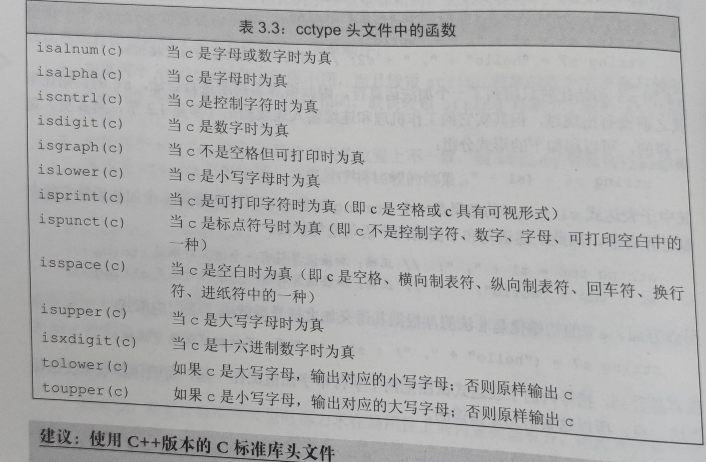
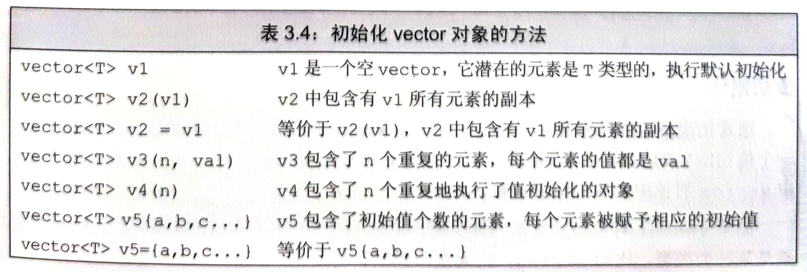
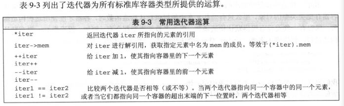
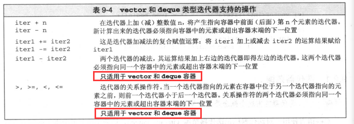

# 字符串向量和数组


string表示可边长的字符序列。

## 3.1命名空间的using声明

using namespace::cin;

头文件不应包含using声明

## 3.2标准库类型string

string 可变长字符序列，再string头文件下

#include<string>

### 3.1.1定义和初始化


#### 直接初始化和拷贝初始化

如果使用等号初始化一个变量实际上是***拷贝初始化***，如果不使用等号则执行的是直接初始化。

### 3.2.2string对象上的操作


#### 读写strin对象

使用iostream读写string对象。再执行读取操作时，iotostr（不确定） 再将数据转化为 string对象会自动忽略开头的空白（空格符，换行符，制表符等），从第一个真正的字符开始到下一个空白结束。

#### 使用getline获取一整行

```cpp
string line
while(getline(cin,line))
     cout<<line<<endl;
```

#### string的empty和size操作

```cpp
string line
while(getline(cin,line)){
     if(!line.empty())
	     cout<<line<<endl;
     
}

```

```cpp
string line
while(getline(cin,line))
    if(line.size()>80)
	     cout<<line<<endl;
```

#### string::size_type类型

标准库中返回size类型返回的是 size_type类型的值，它一定是一个无符号类型的值。且能够足够放下任何string对象的大小。

当一条语句中有size()函数就不要再使用int了这样可以尽量避免应为singled和int混用带来的问题。

#### string的比较

string的比较规则是从前向后依次比较对应位置的元素的大小，忽略string的长度。当两个字符串的长度不一样但是断串的所有字符与长串的前n个字符相等时长串大于短串。

#### string对象赋值

```cpp
string st1(10,'c'),st2
str2 = str1;
//字符串之间可以进行加法运算 
string str3 = "hellot";
str3+=str2;
//字面值可以与字符串进行相加的操作，但是不能出现两个字面值相加的情况。
string str4 = str3+" ";
string str5 = " "+" ,"//错误
```

出现这种情况的原因是因为字面值的字符串和string不是相同的类型。 

### 3.3.3处理string对象中的字符

***c++11***基于范围的for语句

```c++
for(dec:expresion)//形如python中的遍历语句
	statement
for(auto c:str1){//将对应位置的值赋值给c
    
}
//当想使用引用对遍历的内容进行修改时可以使用以下的方式
for(auto &c:str1){
    
}
```

cctype头文件中定义了一些判断字符类型的函数：



## 3.3vector

c++既有类模板也有函数模板，vector是一个类模板。

编译器根据模板创建类或者函数的过程称为实例化。



***c++11***提供一种新的初始化Vector的方法，列表初始化 上图中v5的初始化方式。

再使用花括号进行初始化时，编译器会最先尝试解释为使用初始化list进行初始化。

```cpp
vector<string> v5{"hi"};//列表初始化
vector<string> v6("hi");//错误
vector<string> v7{10};//10个默认初始化的元素
vector<string> v8{8,"hi"};//10和默认为“hi“的元素
```

向vector中添加元素，通常使用push_back()向最后追加元素。

再for语句内不应该改变序列的大小。

不能通过下标的方式添加元素。

## 3.4迭代器

标准库提供了一迭代器用来访问元素。

如果容器为空begin（） 和end()返回值相同。



只有vector和deque迭代器支持的操作。



iter->empty()运算符与(*iter).empty()的意思相同。
